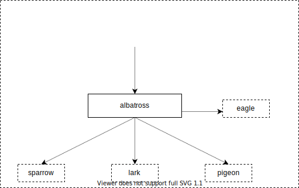

# albatross
sparrow：信天翁

作为Spring Cloud集群的为网关，根据请求参数转发请求并作负载均衡

**功能清单**：

- [X] 负载均衡，路由
- [ ] 网关鉴权

# Arch
**Environment：**

| name   | version                                                        |
|--------|----------------------------------------------------------------|
| Java   | [JDK 17.x](https://www.oracle.com/java/technologies/downloads) |           |

# how to use
1. create ecs task: `aws ecs register-task-definition --cli-input-json file://ecs_task.json`

# Reference
- [Spring Cloud Gateway](https://spring.io/projects/spring-cloud-gateway)
- [AWS ECS](https://docs.aws.amazon.com/ecs/index.html)
  - create ecs task: `aws ecs register-task-definition --cli-input-json file://ecs_task.json` 
- [asciiflow](https://asciiflow.cn/)
- [drawio](https://app.diagrams.net/)
- [banner generator](https://patorjk.com/software/taag/)