# sparrow

sparrow：麻雀

集成一些外部的开源数据或者接口

- 为[www.omoz.cc](www.omoz.cc)内部的其他服务提供稳定简便的RPC API
- 再次为互联网用户提供类似服务，降低使用难度

**功能清单**：

- [X] 根据ip查询ip所在的地理位置(依赖[ip2location](https://www.ip2location.com/))
- [ ] IP地址CIDR计算器
- [ ] 天气查询

# Arch

**Environment：**

| name   | version                                                        |
|--------|----------------------------------------------------------------|
| Java   | [JDK 17.x](https://www.oracle.com/java/technologies/downloads) |
| Groovy | [4.x +](https://groovy.apache.org/download.html)               |

# Reference

- ip地理位置数据库: [ip2location](https://www.ip2location.com/)

## MISC

- gradle打包
  - gradle 打包：`./gradlew build`
  - gradle 发布：`./gradlew publish`
- Docker打包
  - docker构建 image：`docker build -t thinktik/sparrow:latest .`
    - docker构建多架构(X64+ARM64) image
      并发布: `docker buildx build --platform linux/amd64,linux/arm64 -t thinktik/sparrow:latest . --push`
  - docker发布到AWS ECR：`docker image push thinktik/sparrow:latest`
- AWS ECS
    - 创建AWS ECS任务：`aws ecs register-task-definition --cli-input-json file://ecs_task.json`